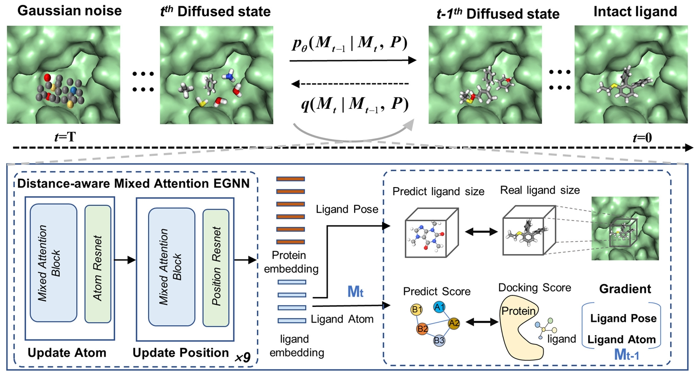
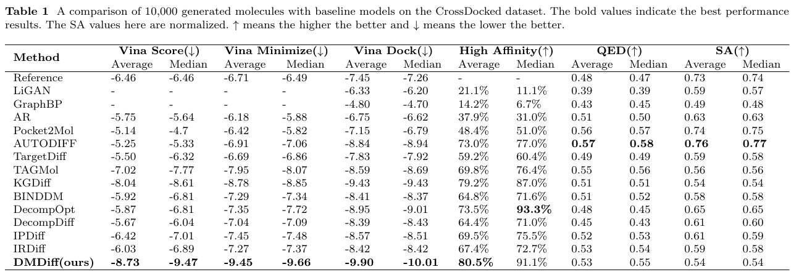

# DMDiff
:rocket:Designing High Affinity 3D Drug Molecules using Distance Aware Mixed Attention Diffusion Model



## Dependency:
Follow the below steps for main dependency installation:
```
conda create -y -n DMDiff tqdm
conda activate DMDiff
conda install pytorch==1.11.0 torchvision==0.12.0 torchaudio==0.10.0 -c pytorch
conda install -y rdkit -c conda-forge
conda install vina
```

or Install based on the **requirement.txt**


## Data:
Download the Crossdocked2020 dataset from :point_right:[here](https://drive.google.com/file/d/1XMVb4UH4atvLtWRIVtJct9ZqYkBvCze6/view?usp=drive_link)
You can directly use our trained checkpoint files for sampling or train yourself in the following way. Checkpoints file is :point_right:[here](https://drive.google.com/file/d/1vf6GQJ_twvcnOrJuQO5YXJlp72mz_w1C/view?usp=sharing)

## Train:
One can specify different model and training configurations in `train.yml`. The following are the training command.


```
python scripts/train_diffusion.py
```
## Smple:
To replicate our results, download the pre-trained checkpoints from :point_right:[here](https://drive.google.com/file/d/1vf6GQJ_twvcnOrJuQO5YXJlp72mz_w1C/view?usp=sharing).

The following are the sample command.

```
python scripts/sample_diffusion.py
```


## Evaluate and dock:
You can dock the generated molecule using the following command, taking care to install Vina and the related dependencies.

```
python scripts/evaluate_diffusion.py
```

Performance of DMDiff on corssdocked dataset compared to existing structure-based 3D molecule generation methods:



Node: 
Our code was developed with reference to the code written by [Guan et al.](https://openreview.net/pdf?id=kJqXEPXMsE0), [Qian et al.](https://academic.oup.com/bib/article/25/1/bbad435/7457350) and we would like to express our gratitude to them. :+1::+1:
If you have any questions, feel free to contact Hao Lu, luhao@stu.ouc.edu.cn :heart::heart:
